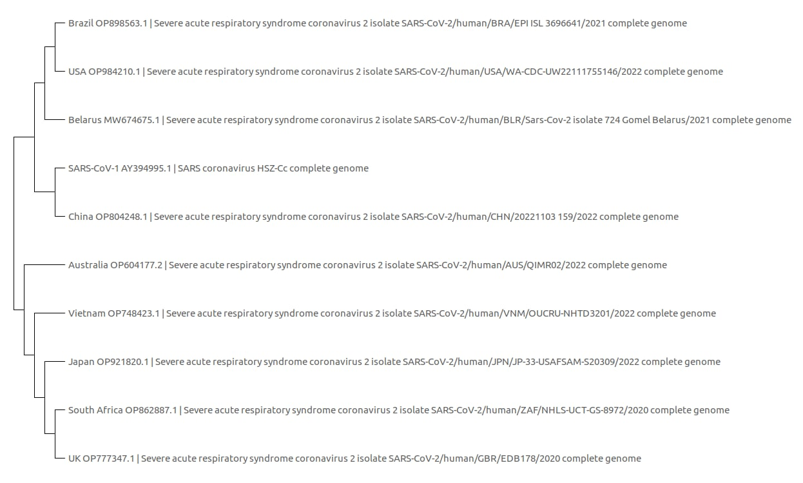
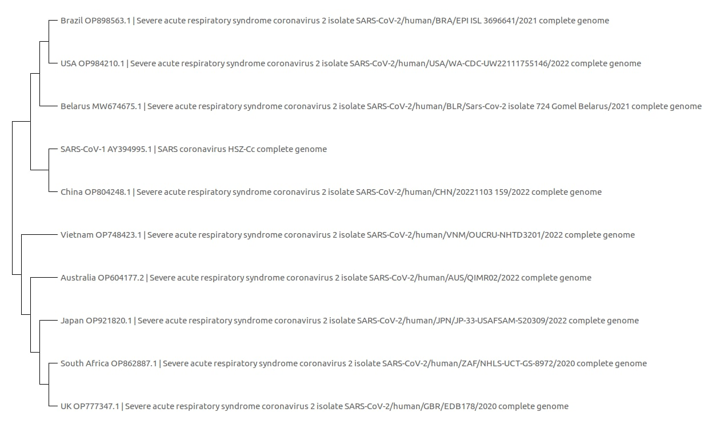
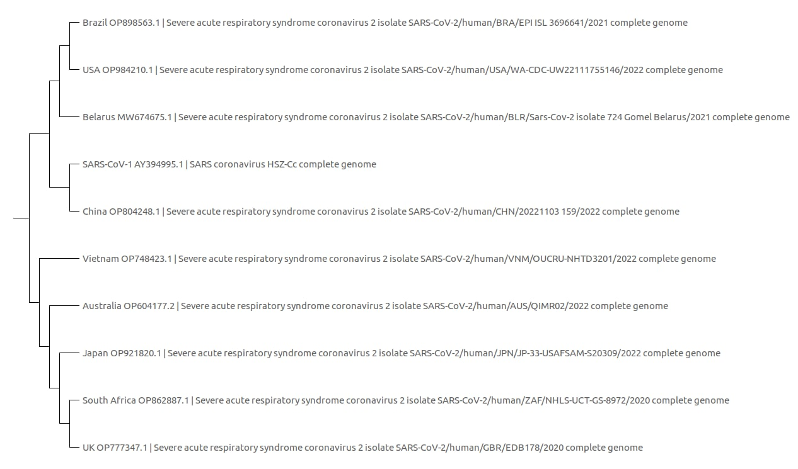

### Цели : 

Рассмотреть 9 геномов SARS-CoV-2 из людей разных стран и 10-й геном SARS-CoV-1, выровнять последовательности и построить деревья 3 различными способами. Сделать вывод о том, кого вирус заразил раньше, а кого позже

#### О данных :

Данные используемые в данной работе взяты с сайта Национального центра биотехнической информации США [NCBI](https://www.ncbi.nlm.nih.gov/) в разделе посвященном [SARS CoV 2](https://www.ncbi.nlm.nih.gov/sars-cov-2/). Все данные представлены в формате .fasta

#### Скачивание:
Последовательности SARS-CoV-2 для следующих стран: Австралия (OP604177.2), Беларусь (MW674675.1), Бразилия (OP898563.1), Китай (OP804248.1), Япония (OP921820.1), ЮАР (OP862887.1), Великобритания (OP777347.1), США (OP984210.1), Вьетнам (OP748423.1), а также SARS-CoV-1 (AY394995.1), все последовательности были взяты с NCBI

### Обработка:

##### Построение деревьев
Выровнием последовательности алгоритмом Muscle с cluster method: UPGMA, получим [выровненные последовательности]([[https://drive.google.com/file/d/1kc6_OVghl_PA2pgcyYUtXgKXkGD4Fk4z/view?usp=drivesdk](https://github.com/isredir/bioinformatics/blob/main/Aut_HW_3/sequences_countries.meg)](https://github.com/isredir/bioinformatics/blob/main/Aut_HW_3/sequences_countries.meg))
Далее построим деревья различными методами - Maximum Likelihood(ML), Neighbor Joining(NJ), Maximum Parsimony, UPGMA.

**Maximum Likehood**

Заметим, что ближе всего к SARS-CoV-1 Китай (соответственно в данной выборке человек из Китая заразился раньше всего), а дальше всего - Великобритания, следовательно человек из нее заразился позже всех(в данной выборке).

**Neighbor Joining**

Заметим, что ближе всего к SARS-CoV-1 Китай, а дальше всего Великобритания.

**Maximum Parsimony**

Заметим, что ближе всего к SARS-CoV-1 Китай, а дальше всего Великобритания.

**UPGMA**

Заметим, что ближе всего к SARS-CoV-1 Китай, а дальше всего Великобритания.

#### Поиск различий

Отдельно рассмотрим пары из самой ближней и самой дальней страны в деревьях, то есть Китая и Великобритании.
Для повышения точности выровним отдельно эти страны, а затем выделим мутации, выбрав в mega x: toggle conserved sites 100%.

Найдем мутации в Великобритании относительно Китая:

Первые три из рассмотренных мутаций попадают в **orf1ab polyprotein**, четвертая мутация (с координатой 24969) произошла в некодирующем участке **S**, а пятая (с координатой 28240) Произошла в конце участка **ORF7b** - начале участка **N**.

Эти выводы можно сделать, рассмотрев разметку генома

